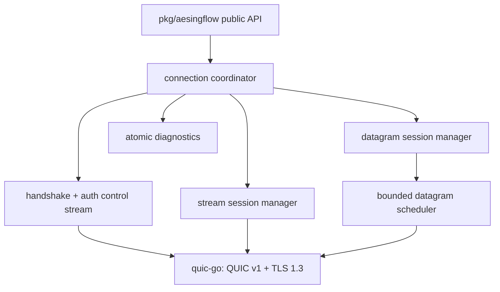

# AesingFlow architecture

AesingFlow has two authenticated layers: QUIC v1 with TLS 1.3 provides transport encryption, congestion control, loss recovery, migration and stream flow control; the AesingFlow control stream provides application version/capability negotiation and session lifecycle.

One connection owns its state transition function, session maps and cancellation context. Control writes are serialized. There is one bounded scheduling worker for outgoing datagrams, one receiver for incoming datagrams, and one acceptor for peer streams; no goroutine is created per packet. QUIC streams retain QUIC flow control as the primary backpressure mechanism.

QUIC implements recovery, congestion control, pacing and migration. AesingFlow does not duplicate those algorithms. AesingFlow bounds its own queues, gives control traffic a dedicated reliable stream, expires datagrams at the application boundary, and keeps logical session IDs independent of QUIC stream IDs.

Session recovery is negotiated as a capability only. Resuming sessions across a *new* QUIC connection is intentionally not implemented in this stage: it requires a protected resumption credential and explicit ownership semantics. A connection that remains alive across path migration retains its sessions through QUIC.
