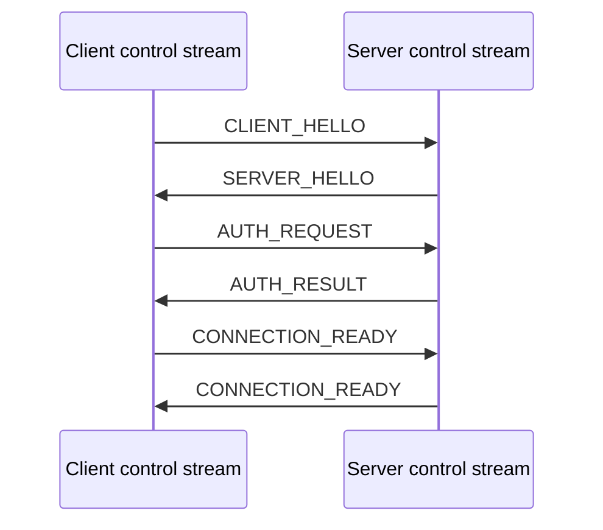

# AesingFlow wire protocol

## Scope and versioning

AesingFlow is an application protocol over QUIC v1/TLS 1.3. The current version is `1.0`. A major mismatch is rejected. A peer must select the same major and a minor no greater than the peer's offered minor. Capabilities are a `uint64` bit set: unknown mandatory bits reject negotiation; unknown optional bits are ignored.

## Control frame

All control frames use network byte order:

| Field | Size |
|---|---:|
| magic `AFLO` | 4 bytes |
| major, minor, type, flags | 4 bytes |
| request ID | 8 bytes |
| payload length | 4 bytes |
| TLV payload | bounded |

The TLV payload has `field type:uint16`, `field flags:uint8`, `length:uint32`, and value. Bit 0 of field flags marks a required field. Unknown optional fields are skipped. Duplicate fields and malformed/oversized lengths are protocol errors. The default maximum control frame is 64 KiB.

Message types are `CLIENT_HELLO`, `SERVER_HELLO`, `AUTH_REQUEST`, `AUTH_RESULT`, `CONNECTION_READY`, `OPEN_STREAM`, `STREAM_RESULT`, `OPEN_DATAGRAM_SESSION`, `DATAGRAM_SESSION_RESULT`, `CLOSE_SESSION`, `PING`, `PONG`, `STATS`, `GOAWAY`, and `ERROR`.

Client hello carries protocol magic/version, capabilities, random connection ID, timestamp and nonce, control/datagram limits, recovery and padding support, implementation name/version. Server hello supplies its selected version/capabilities, random ID/nonce, limits, idle/keepalive values and negotiation result. Authentication echoes the client nonce and timestamp; the server rejects stale or replayed nonces.

## Sessions

Reliable sessions are QUIC bidirectional streams. The stream starts with an eight-byte AesingFlow session ID, then arbitrary user bytes. `OPEN_STREAM` and `STREAM_RESULT` inform the peer of lifecycle events. FIN provides half-close.

QUIC DATAGRAM payloads begin with version (1), flags (1), session ID (8), sequence (4), fragment index (1), fragment count (1), payload length (2), then payload. Fragmentation is disabled in the initial public API: payloads exceeding the negotiated safe maximum fail. Incoming duplicates are dropped within a bounded receive window.

Connection states are `NEW → CONNECTING → QUIC_READY → NEGOTIATING → AUTHENTICATING → READY → DRAINING → CLOSING → CLOSED`; failure from operational states enters `FAILED` then `CLOSED`. Session states are `CREATED → OPENING → ACTIVE → HALF_CLOSED → CLOSING → CLOSED`, with failure allowed from nonterminal states. Any other transition is rejected.

Application errors use the stable numeric codes in `core/errors`; details sent to peers are safe strings only. `GOAWAY` stops new sessions and `CloseWithError` closes the QUIC application connection.
